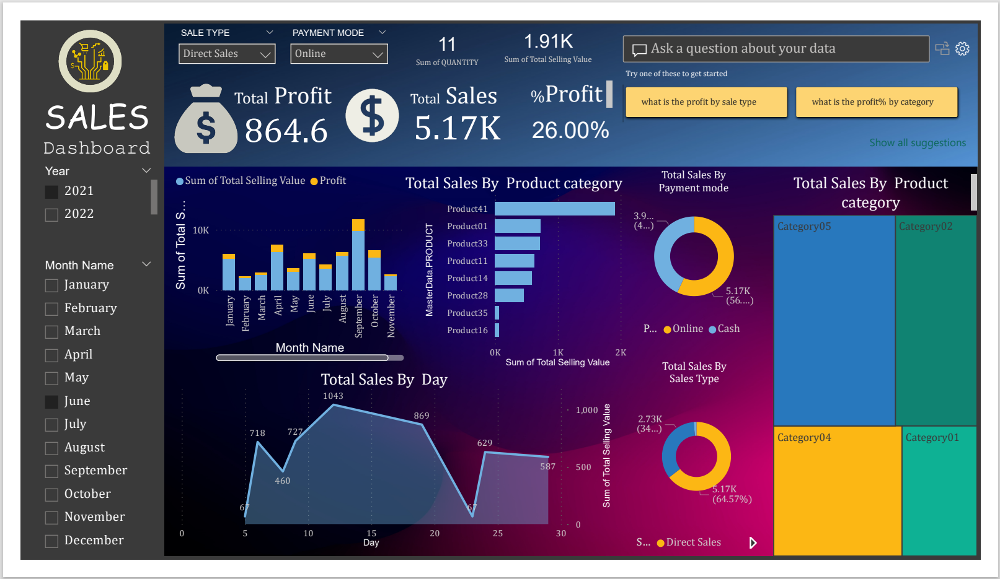

# Power BI Dashboard

## Overview

This project demonstrates how to create a comprehensive **Power BI Dashboard** to visualize key business metrics for sales performance. The dashboard offers insights into sales trends, products segmentation, regional performance, and profitability. This repository includes the Power BI `.pbix` file, data sources, and instructions on how to recreate the dashboard.

### Key Features:
- **Sales Overview**: Visualize total sales, growth, and trends over time.
- **Top Products**: Highlight the best-selling products and categories.
- **Question Answer**: Ask any questions about the dataset in human language and get the answers.
- **Product Segmentation**: Understand key product demographics and purchasing behavior.

---

## Dashboard Preview

Here is a preview of the Power BI Dashboard:



> **Note**: The image above is a sample of the final dashboard. You can view and interact with it after following the setup instructions below.

---

## Project Structure

```
|-- /data/                      # Sample data files used in the dashboard (CSV, Excel)
|-- /images/                    # Images for the README and documentation
|   |-- sales.png    # Example image of the Power BI Dashboard
|-- /pbix/                      # Power BI file
|   |-- sales_dashboard.pbix   # The Power BI file containing the dashboard
|-- README.md                   # Project documentation (this file)
```

---

## Getting Started

### Prerequisites
1. **Power BI Desktop**: Ensure that you have the latest version of Power BI Desktop installed. You can download it from the official [Power BI website](https://powerbi.microsoft.com/desktop/).
2. **Sample Data**: This project uses sample sales data, which can be found in the `/data` folder.

### Installation Steps
1. Clone this repository to your local machine:
    ```bash
    git clone https://github.com/rakiiibul//data_AV_PBI.git
    cd data_AV_PBI
    ```
2. Open the `sales_dashboard.pbix` file located in the `/pbix` folder using **Power BI Desktop**.

3. The sample data is already loaded into the Power BI file. You can either use this data or replace it with your own data by modifying the data connections.

---

## Usage

1. **Explore the Dashboard**: Open the `.pbix` file in Power BI Desktop and explore the pre-built dashboard.
2. **Modify Visualizations**: You can easily customize any visualizations, graphs, or data filters based on your needs.
3. **Connect Your Data**: To replace the sample data with your own:
   - Go to the **Home** tab and click **Transform Data**.
   - Update the data source paths to point to your local data.

---

## Data Sources

The dashboard was built using sample sales data that includes:
- **Product Sales**: Information on sales volume, product categories, and revenue.
- **Customer Information**: Data about customer demographics and purchase behavior.
- **Geographical Data**: Regional sales data across different cities and countries.

---

## Customization

Feel free to customize the following:
- **Visualizations**: Adjust graphs, charts, and data tables as per your analysis requirements.
- **Data Sources**: Connect new data sources by navigating to `Home -> Transform Data -> Data Source Settings`.
- **Filters and Slicers**: Add or modify filters for more dynamic reports.

---

## Contributing

If you'd like to contribute to this project, please:
1. Fork the repository
2. Create a new branch for your feature/bug fix (`git checkout -b feature-name`)
3. Commit your changes (`git commit -m "Description of your changes"`)
4. Push the branch (`git push origin feature-name`)
5. Open a Pull Request

---

## License

This project is licensed under the MIT License - see the [LICENSE](LICENSE) file for details.

---

## Contact

If you have any questions or feedback, feel free to reach out via email at `rakiiibul@outlook.com` or create an issue in this repository.

---

 
